# Installation

1. Clone the application from github
1. Open the project in Visual Studio
1. Run the project
1. All is done! ](./images/he database will be created )tomatically with basic data

# Connection strings

As you can see, we use SQLite database, which will be automatically be created in the project's files'.

```json
  "ConnectionStrings": {
    "DefaultConnection": "Data Source=database.sqlite"
  },
```

# Created accounts

- Login: `admin` Password: `admin`
- Login: `user` Password: `user`

# Project overview

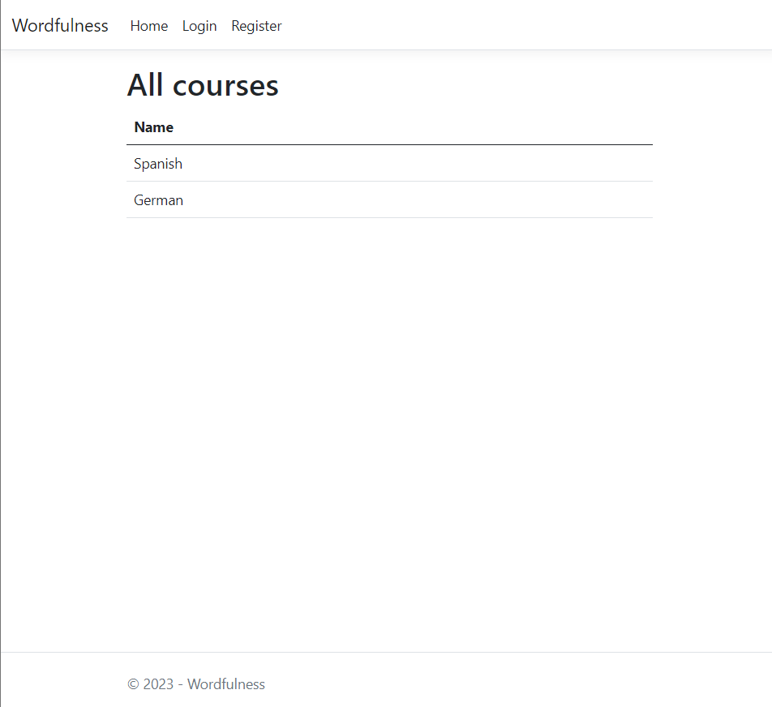

As you can see, unauthorized user doesn't see much. We can see only a list of courses.

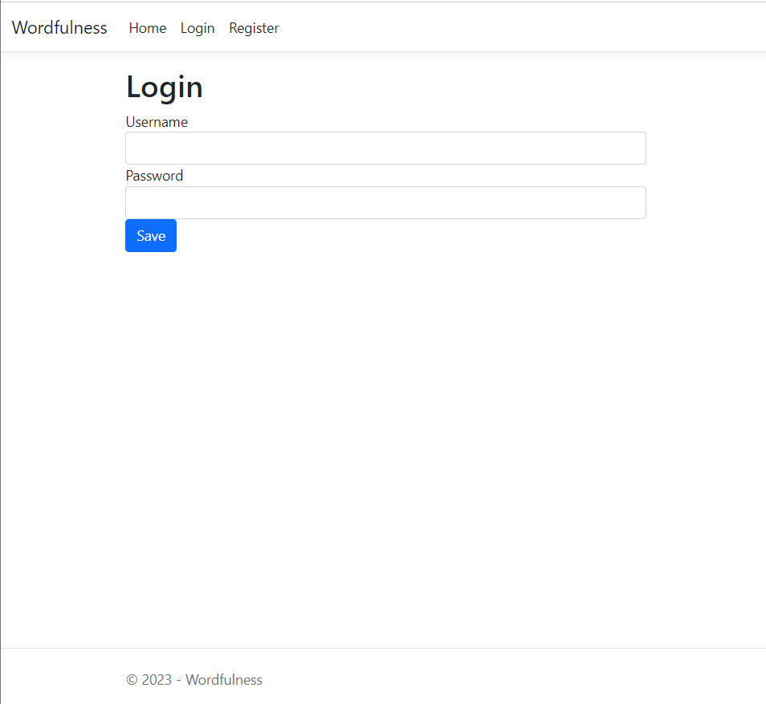

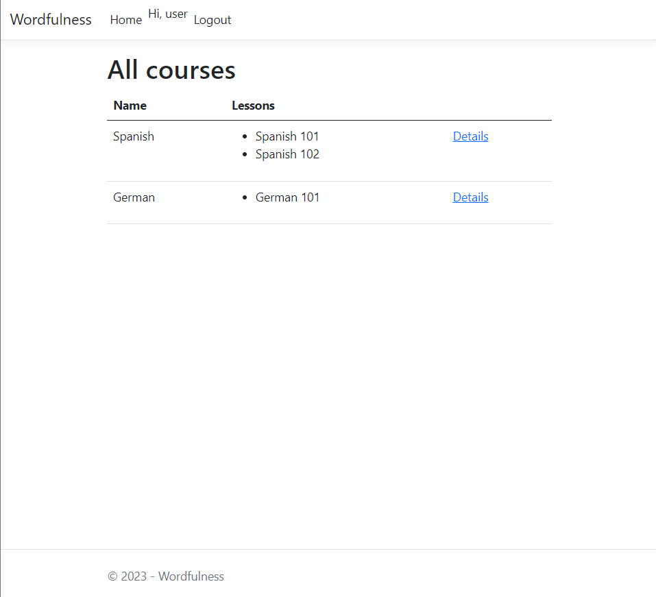

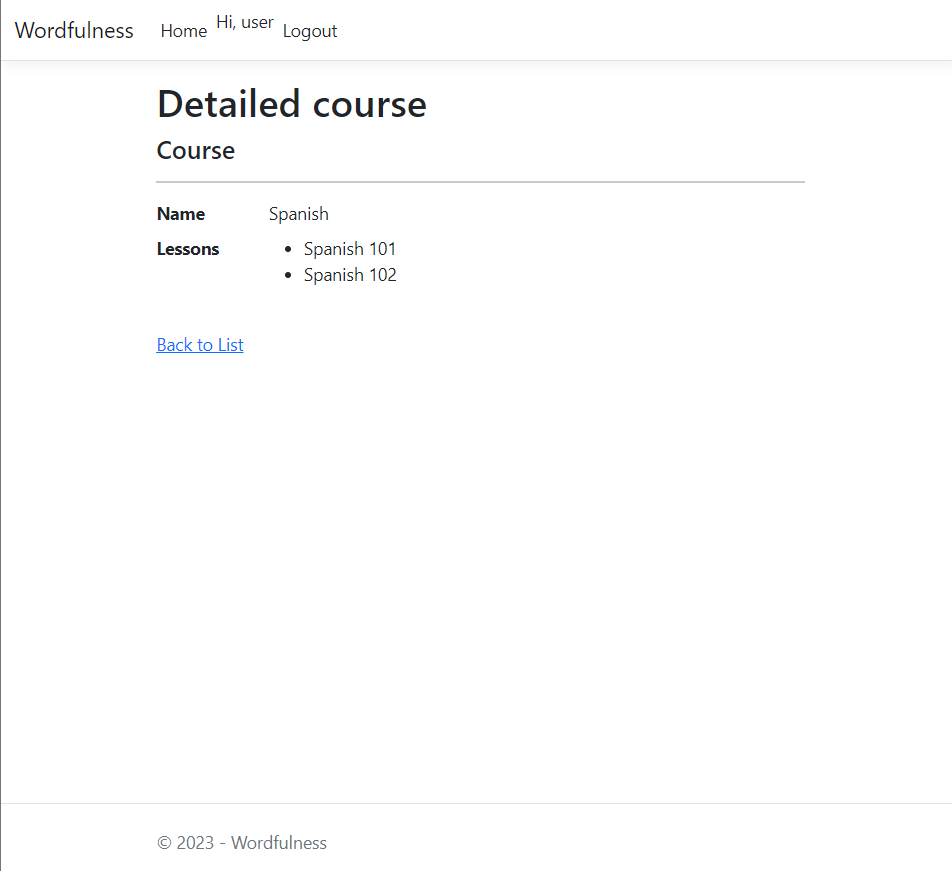

After logging in as user, we can see which lessons are in the courses and we can access detailed course view.

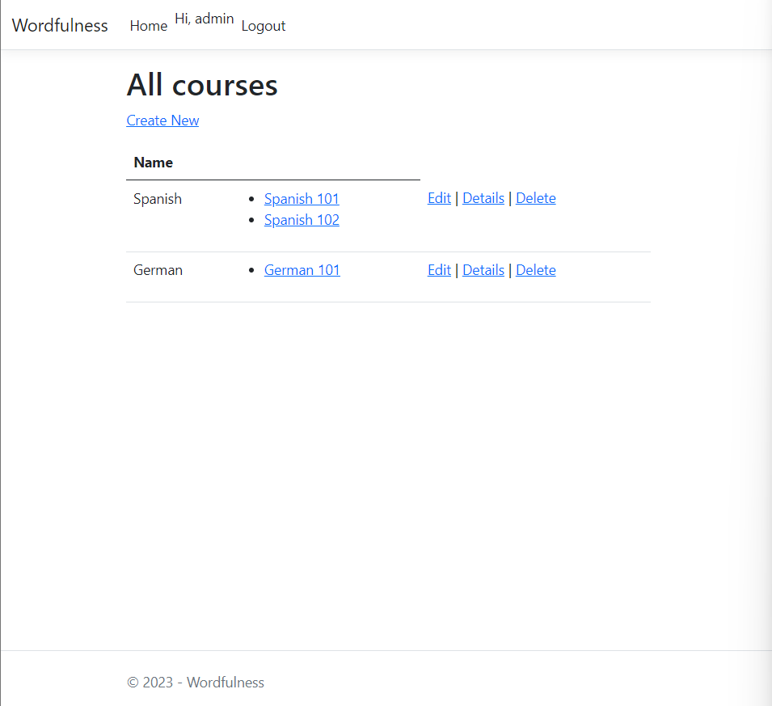

If we log out and log in as admin, we have full access to the website

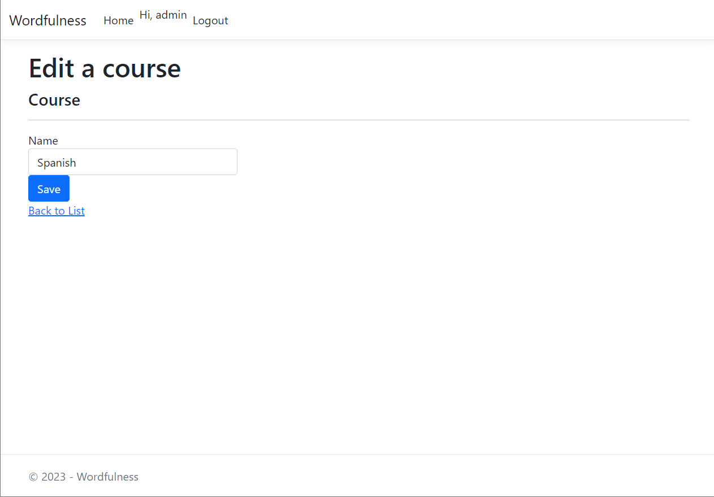

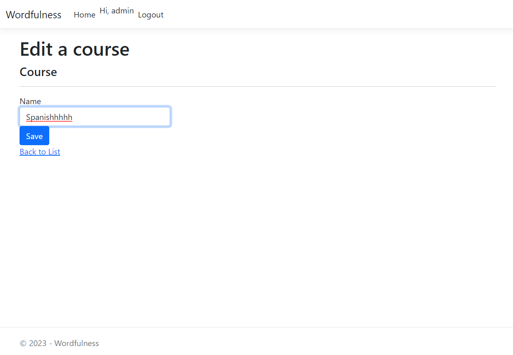

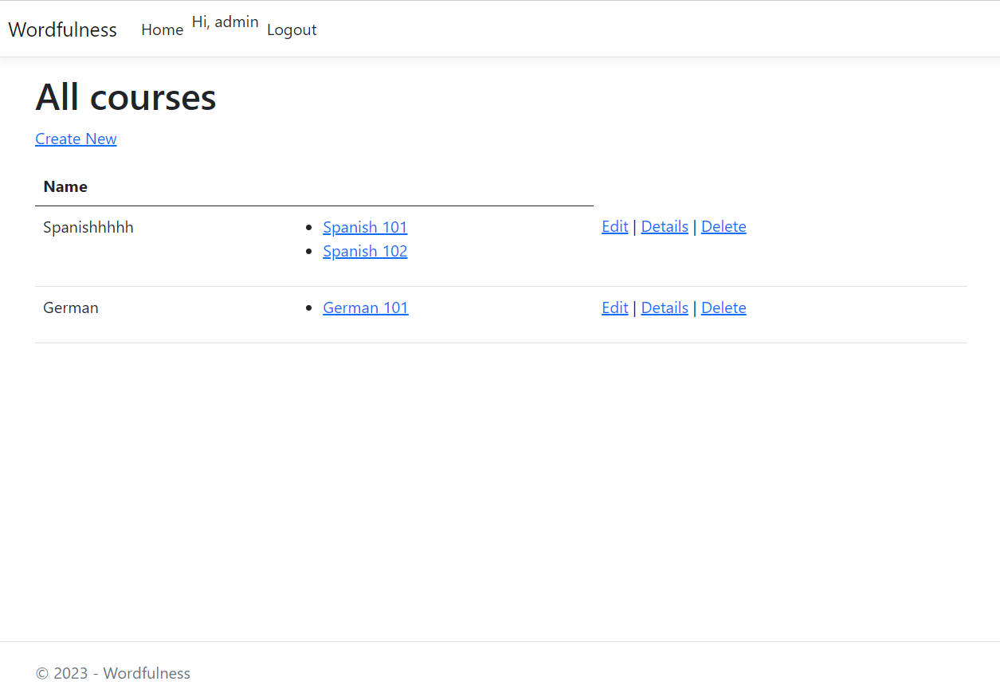

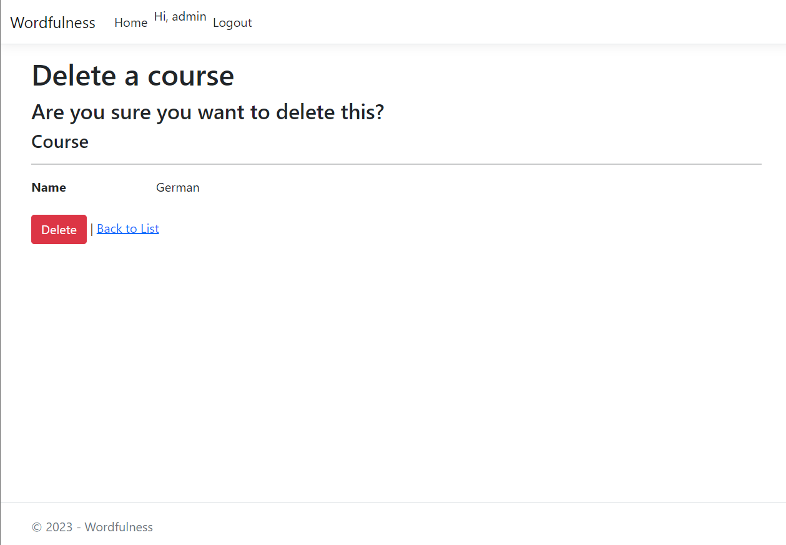

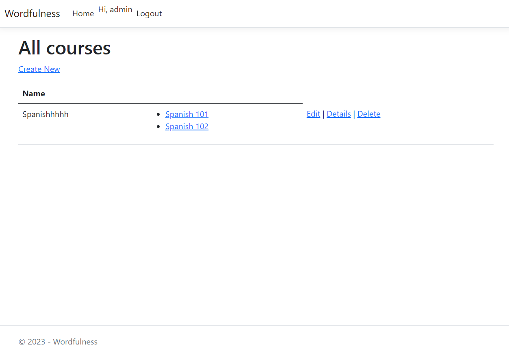

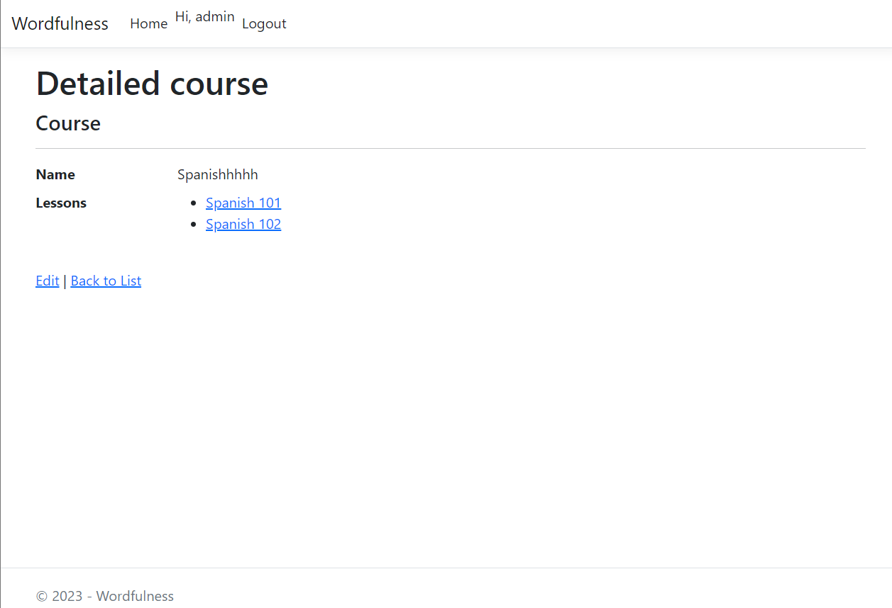

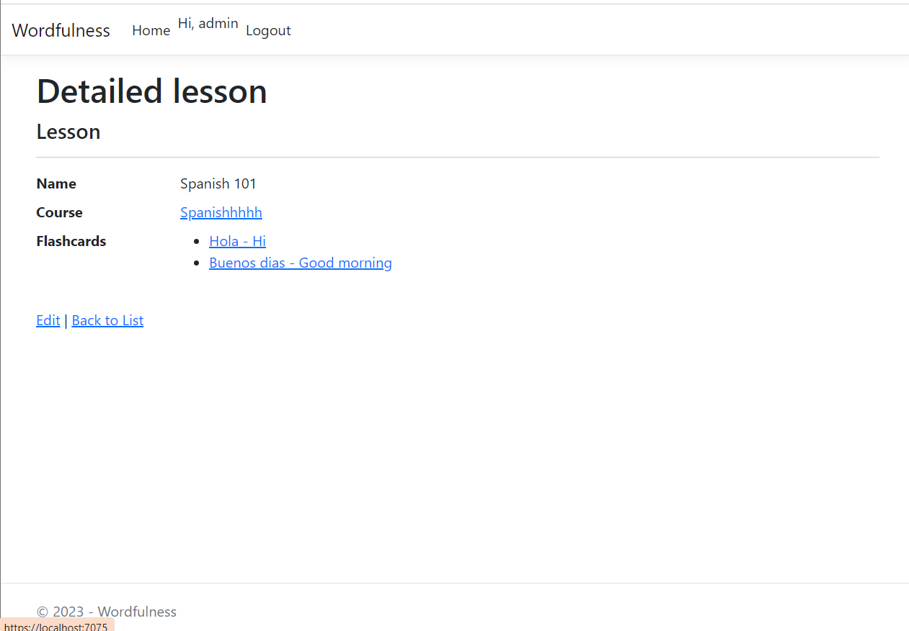

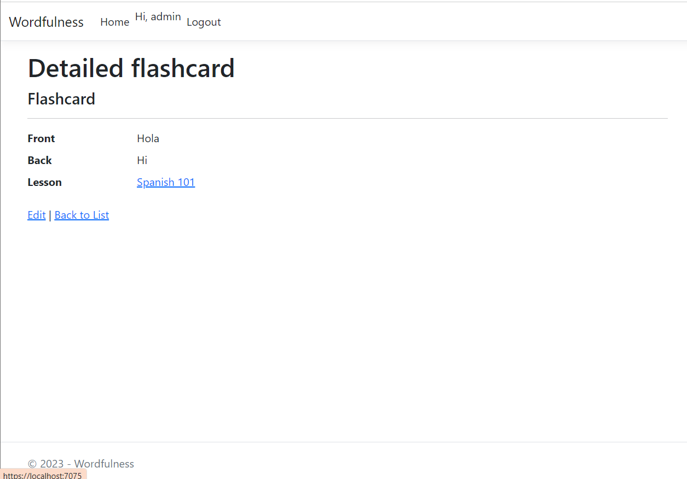